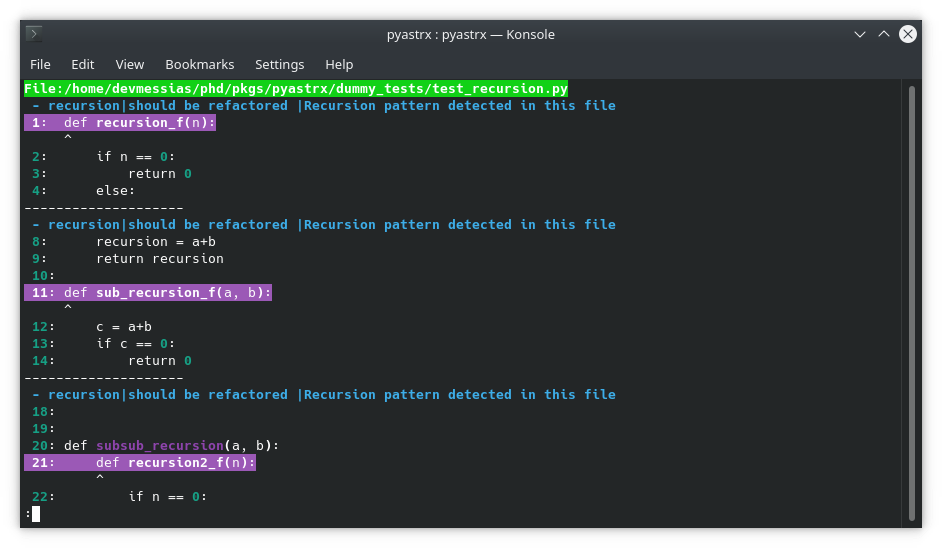
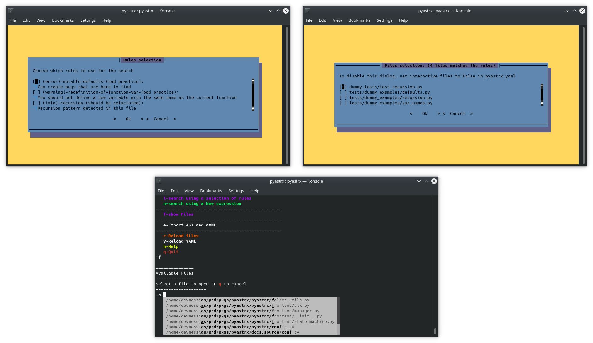
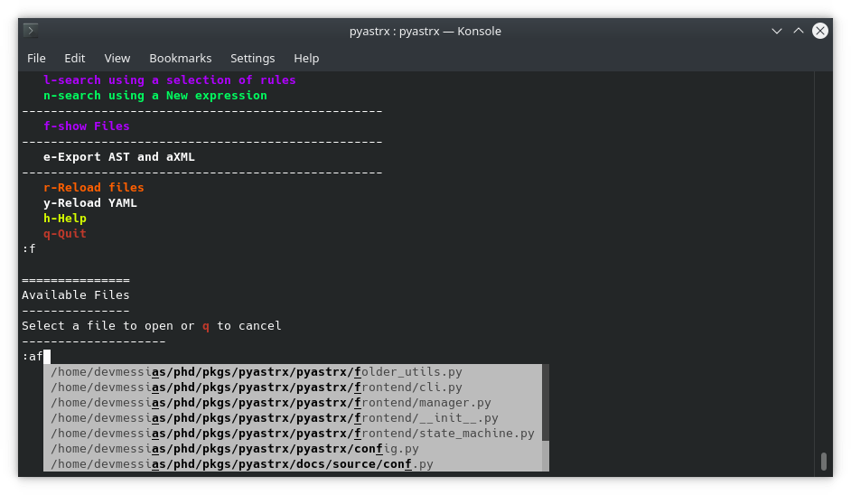
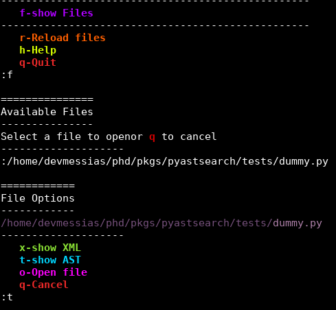

# What is PyASTrX?


<h1 style="text-align:center;">
<em>
    "Simple projects are all alike; each complex project
    is complex in its own way."
</em>
-
<strong>
    (adapted from Tolstoy's Anna Karenina)
</strong>
</h1>

The PyASTrX philosophy is to provide a simple, easy-to-use, and
extensible framework for code quality analysis, refactoring and codebase analysis.


The main point that I've developed is that sometimes a necessary practice in one project can be a bad practice in another
project. In other words, we should **walk a **mile in **someone's** shoes** before judging the code quality of someone else code.


PyASTrX allows you to define new code analysis patterns using just XPATH
expressions.

## Features and Characteristics


PyASTrX provides the following features:

### An easy customizable code quality analysis tool.

Type `pyastrx -h` to see all the options.

You can also use a `.pyastrx.yaml` file to configure the tool.

### Human-friendly


#### Search and Linter outputs

If your codebase or pull request is huge, looking for possible
mistakes, bad practices or code smells can be a pain, so PyASTrX
provides a human-friendly output as default.

{.align-center}

#### Friendly interface

-   autocomplete the previous queries
-   combo box to select the files
-   colorized syntax highlighting

{.align-center}

### pre-commit


Copy the [main.py]{.title-ref} available at
[pyastrx/.pre-commit-hook](https://github.com/devmessias/pyastrx/blob/main/.pre-commit-hook/main.py)
in your folder and add the following entry in your
`.pre-commit-config.yaml` file:

```yaml
 - repo: local
        hooks:
        - id: pyastrx
            name: PyASTrX linter
            entry: ./<LOCATION>/main.py
            language: script
            args: ["-q"]
            types: ["python"]
            description: Check for any violations using the .pyastrx.yaml config
```

Later on, I will ship this to be used in the pre-commit channels.

### Explore the AST and XML


Using the **-i** arg or adding a `interactive:
true` in your `pyastrx.yaml` you can explore
the AST and XML parsed AST of your code. This can be useful to
understand your codebase and helps you to write your custom XPATH
queries to be used in your project.

### Folder and file explorer

**Start the interactive interface**

``` {.console}
$ pyastrx -i -d path_to_folder (or just save that in yaml)
```

**Press f and choose a file**

{.align-center
width="45.0%"}

**Choose the ast (t), xml (x) or code exploration (o)**

{.align-center
width="45.0%"}

**Learn!**

{.align-center
width="45.0%"}

{.align-center
width="45.0%"}

#### File exploration (one key-press distance)

**Open the interactive with the python file**

``` {.console}
$ pyastrx -i -f path_to_file (or just save that in yaml)
```

**Choose the ast (t), xml (x) or code exploration (o)*

## On the shoulders of giants


This project is possible only because of the work of several
developers across the following projects:

### lxml


One of the greatest Python libraries downloaded over millions of time.
Please, consider doing a donation to the [lxml](https://lxml.de/)
developers.


### astpath


The PyASTrX started with the idea of using the astpath as a dependency,
but I've decided to rewrite and redesign it to improve the
maintainability and the usability features of PyASTrX.
[astpath](https://github.com/hchasestevens/astpath) is a great and
simple tool developed by [H. Chase
Stevens](http://www.chasestevens.com/).


### GAST


[GAST](https://github.com/serge-sans-paille/gast) is a remarkable
tool developed by [Serge Sans
Paille](http://serge.liyun.free.fr/serge/). GAST allows you to use the
same XPATH expressions to analyze different code bases written in
different python versions.


### prompt_toolkit


A project created by [Jonathan Slenders](https://github.com/jonathanslenders) that
Provides a powerful and reliable way to construct command-line interfaces.

This project has a lot of features, good documentation and the
maintainers keep it well updated.
